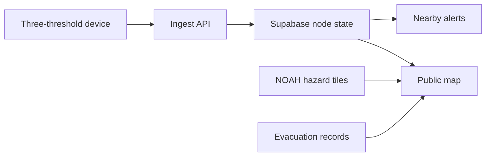

<p align="center">
  
</p>

<h1 align="center">Flood-Level Observation &amp; Warning</h1>

<p align="center">
  A public, map-first view of water-level observations, nearby alerts, and flood context in the Philippines.
</p>

<p align="center">
  <a href="https://flow-startup.vercel.app/">Open FLOW</a> ·
  <a href="#how-flow-works">How it works</a> ·
  <a href="#run-locally">Run locally</a>
</p>

---

FLOW connects registered water-level monitoring points to a public map. Each device reports three fixed thresholds. The app turns those reports into a clear current status, shows when the last reading arrived, and alerts people near a point when its level rises. Modeled flood hazard and recorded evacuation sites add context to the map.

## What you can do

| Feature | In FLOW |
| --- | --- |
| **See current observations** | Find monitoring points by name or area, filter by status, and open a point to see its last report, individual threshold states, and nearby points. |
| **Get nearby alerts** | Receive an on-screen alert when a monitored level rises within 3 km. With permission and web push configured, alerts can arrive while the app is closed. |
| **Explore the map** | Switch between standard and satellite views, adjust the camera, and show or hide modeled NOAH flood hazard for 5-year and 100-year scenarios. |
| **Find recorded evacuation sites** | Browse mapped candidate sites in Metro Manila by name or city. The map also highlights a selected site's location. |
| **Install FLOW** | Use the responsive web app on desktop or add it to a supported phone's home screen. |

The **FLOW Intelligence** panel currently summarizes the latest sensor observation in plain language. The directions action opens the selected monitoring point in Google Maps; it does not calculate a flood-safe route. AI-assisted recommendations are a future project goal.

## How FLOW works



A registered device sends probe states with a unique message ID and its own token. The server validates the report and stores the latest state. The map refreshes when a node changes, with periodic refresh as a fallback. Background push is dispatched for eligible rising levels near saved alert areas.

| Level | Map status | Meaning |
| --- | --- | --- |
| `0` | Below threshold | None of the three probes has been reached. |
| `1` | Advisory | First threshold reached. |
| `2` | Watch | Second threshold reached. |
| `3` | Warning | Third threshold reached. |

An invalid probe combination is marked **Sensor fault**. A reading older than two minutes, or a lost connection, is marked **Unavailable**. A below-threshold reading describes that monitoring point; it does not establish that nearby streets are dry.

### Map context and alerts

The colored **NOAH hazard layer** is a modeled rainfall scenario, separate from live sensor readings. FLOW serves bundled hazard tiles where available and can fall back to remote PMTiles archives. Coverage and detail vary across the Philippines; a colored area does not indicate flooding at the present moment.

**Evacuation sites** are recorded candidates, initially sourced from OpenStreetMap. Their opening status and route safety are not verified. Confirm arrangements and follow instructions from the relevant local disaster office.

For **nearby alerts**, FLOW checks rising levels within 3 km of the user's permitted location. While the app is open, it can update the location and display alerts on screen. Closed-app web push uses the last approximate area saved while FLOW was open; users should update that area when they move.

## Run locally

Use **Node.js 22**. A Supabase project with the FLOW schema must already be provisioned; this repository does not include a database migration to create it.

```sh
npm ci
cp .env.example .env.local
npm run dev
```

On Windows PowerShell, replace `cp` with `Copy-Item .env.example .env.local`. Set your values in `.env.local`, then visit [http://localhost:3000](http://localhost:3000). The app requires browser location access to enter the map. Keep `.env.local` out of version control.

### Environment variables

| Variable | Use |
| --- | --- |
| `NEXT_PUBLIC_SUPABASE_URL` | Supabase project URL. |
| `NEXT_PUBLIC_SUPABASE_PUBLISHABLE_KEY` | Browser-safe publishable key for public map reads. |
| `SUPABASE_SECRET_KEY` | Server-only key for protected database operations. |
| `FLOW_INSTALLER_SECRET` | Server-only secret of at least 32 characters for registering or rotating devices. |
| `SITE_ORIGIN` | Deployed app origin for protected browser requests, for example `https://flow-startup.vercel.app`. |
| `NEXT_PUBLIC_NOAH_5YR_PMTILES_URL`, `NEXT_PUBLIC_NOAH_100YR_PMTILES_URL` | Optional overrides for the remote hazard archives. |
| `NEXT_PUBLIC_VAPID_PUBLIC_KEY`, `VAPID_PRIVATE_KEY`, `VAPID_SUBJECT` | Web push keys and contact subject for closed-app alerts. Run `node scripts/generate-vapid.mjs` to generate a key pair. |

Only variables prefixed `NEXT_PUBLIC_` are exposed to the browser. Never put the installer secret, device token, Supabase server key, or VAPID private key in a public variable or commit.

### Database and device API

The server expects these Supabase objects:

- Tables: `public.flow_nodes`, `public.flow_evacuation_sites`, `public.flow_push_subscriptions`.
- Functions: `public.flow_write_node`, `public.flow_accept_reading`, `public.flow_store_push_subscription`, `public.flow_claim_rising_alert`.

| Route | Purpose |
| --- | --- |
| `POST /api/register-node` | Create or update a monitoring point, or rotate its device token. Requires the installer secret. |
| `POST /api/ingest-reading` | Accept a device's three probe states using its device token. |
| `GET /api/evacuation-sites` | Load recorded sites for the map. |
| `POST /api/alerts/subscription` | Save a permitted browser push subscription and approximate alert area. |

The registration response returns the device token when a point is created or its token is rotated. Save it securely when issued. The device firmware is managed separately from this web repository.

To test an already registered point, set `FLOW_INGEST_URL`, `FLOW_DEVICE_ID`, and `FLOW_DEVICE_TOKEN` in your shell, then send a sample level:

```sh
npm run send-reading -- 1
```

Use a number from `0` through `3`. The script does not register a device or create database tables.

## Validate and deploy

```sh
npm run check
```

This runs the type check, project tests, and production build. Set the same required environment values in your deployment and connect it to the provisioned Supabase project. The installed app shows an offline page when navigation cannot connect; fresh sensor readings and alerts require a network connection.

<sub>Map and data credits: NOAH flood hazard (ODbL); © OpenStreetMap contributors for initial evacuation site data and map labels; OpenFreeMap map tiles; Esri satellite imagery. Interface icon paths adapted from Lucide (ISC).</sub>